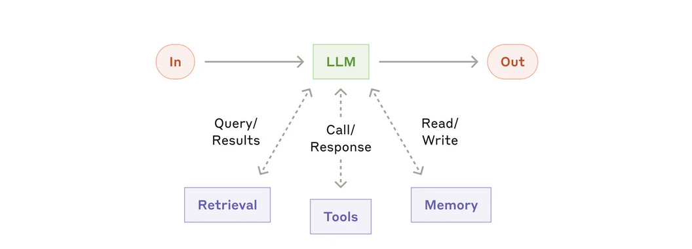
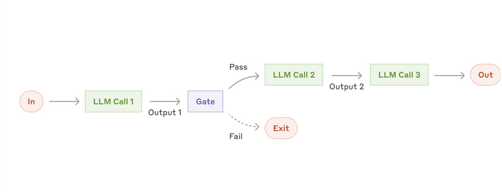
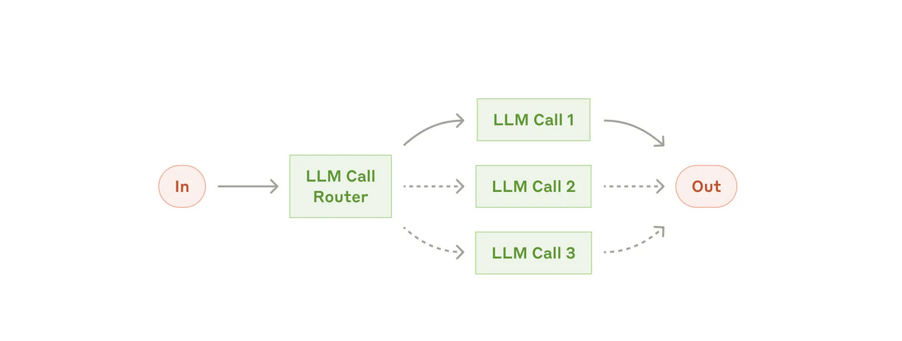

# Über diesen Abschnitt
Dieser Abschnitt enthält Informationen über Software Architektur von KI-Systemen.

## Agentic Systems
Antrophic teilt Systeme, die LLMs verwenden, in zwei Kategorien ein:

- Workflows are systems where LLMs and tools are orchestrated through predefined code paths.
- Agents, on the other hand, are systems where LLMs dynamically direct their own processes and tool usage, maintaining control over how they accomplish tasks.

Agenten-Systeme lösen Probleme autonom und dynamsich unter Verwendung von LLMs. 
Workflow-Systeme lösen Probleme durch fest programmierte Abläufe unter Verwendung von LLMs.
Beide Kategorien können unter dem Begriff Agentic System zusammengefasst werden.

Quellen:
- https://www.anthropic.com/engineering/building-effective-agents

### Building Block: The augmented LLM
Der Grundbaustein agentenbasierter Systeme ist ein LLM, das durch Funktionen wie Retrieval, Tools und Speicher erweitert wird.

Retrieval
- Der Abruf von Informationen aus Datenbanken, Dateisystemen und anderen Quellen
 ist ein erster wichtiger Schritt, um den Kontext für KI-Modelle zu verbessern.
 - Das wird häufig mit Retrieval augmented generation (RAG) gemacht.

 Tools
 - Services, APIs etc. die von der LLM aufgerufen werden können um
 weitere Informationen zu besorgen

 Memory
 - Die Erinnerung an das, was bisher mit der LLM ausgetauscht wurde.
 - Dies beeinflusst die Qualität der Antworten

Die Kombination dieser drei Konzepte ermöglicht es, Anwendungen über einfache KI-Modelle hinaus zu verbessern und deren Effektivität zu steigern.

Quellen:
- https://www.anthropic.com/engineering/building-effective-agents

### Workflow: Prompt chaining

Beim Prompt-Chaining wird eine Aufgabe in Teilschritte zerlegt.
Jeder LLM-Aufruf verarbeitet den Output des vorherigen LLM-Aufrufs.
Zwischen den Aufrufen können programmatische checks eingebaut werden.

Anwendbarkeit
- Wenn ein Task einfach und sauber in eine feste Anzahl Sub-tasks
aufgeteilt werden kann. 
- Dieses Pattern erhöht die Latenz bis zum finalen Ergebnis. Dies wird
mit dem Ziel eine höhere Qualität der Antwort zu erreichen in Kauf genommen.

Beispiel Use Cases
- Schreiben einer Gliederung eines Dokuments, prüfen ob die Gliederung bestimmten Kriterien entspricht,
anschließend das Dokument auf Grundlage der Gliederung schreiben

Quellen:
- https://www.anthropic.com/engineering/building-effective-agents

### Workflow: Routing

Beim Routing wird der Input durch einen LLM Call Router klassifiziert.
Anschließend wird der Aufruf an einen spezialisierten LLM Call übergeben.
Dieser Workflow würdigt die Trennung nach Zuständigkeiten
(separation of concerns) und ermöglicht das Erzeugen spezialisierterer
Prompts. 

Anwendbarkeit
- Bei komplexen Aufgaben, die unterschiedlichen Kategorien zugeordnet
werden können und jede dieser Kategorien besser separat behandelt wird.
Die Klassifizierung muss dabei maschinell z.B. durch eine LLM oder einen
Klassifizierungs-Algorithmus bewerkstelligt werden können.

Beispiel Use Cases
- Kunden-Anfragen an Sub-Prozesse, Prompts und tools weiterleiten (allgemeine Fragen,
Reklamationen, technischer Support)
- Einfache/allgemeine Fragen an kleine Modelle weiterleiten und schwierigere
Fragen an größere Modelle